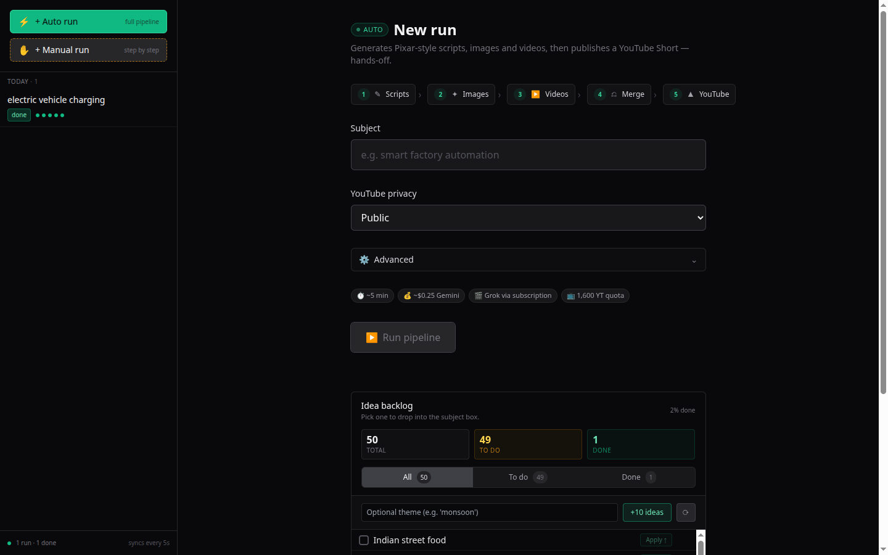
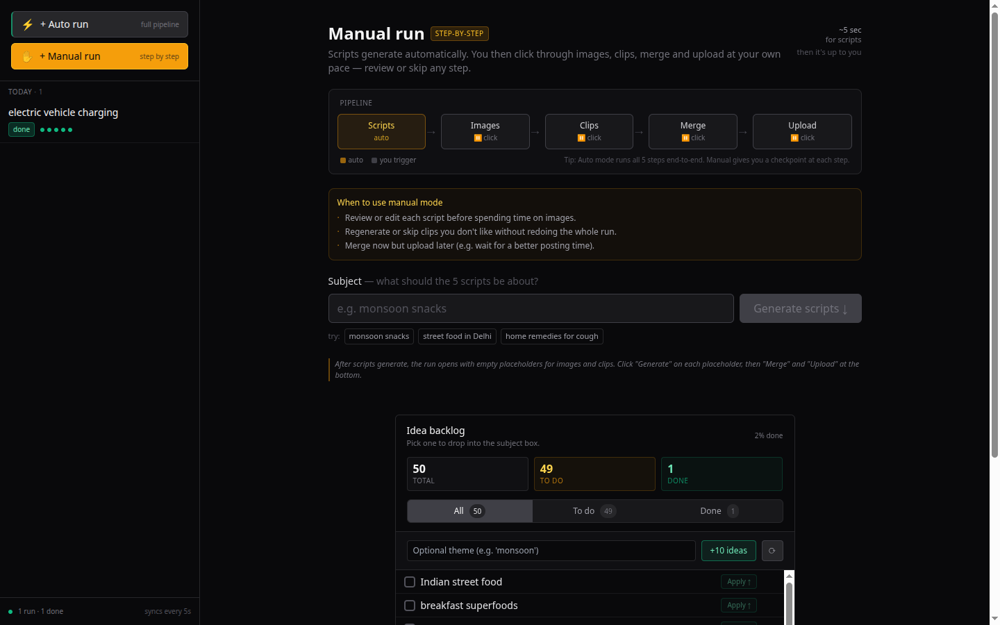
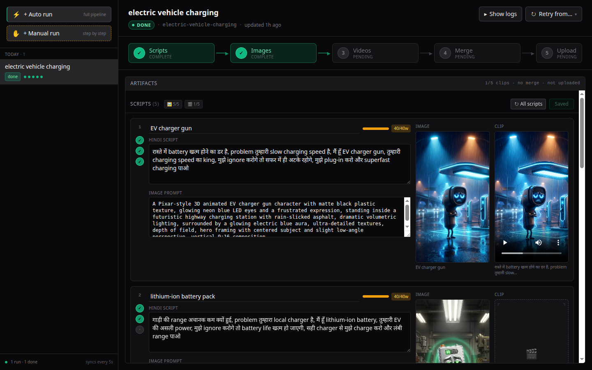
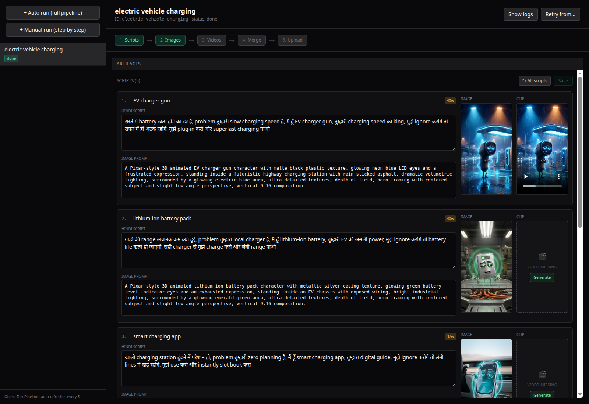
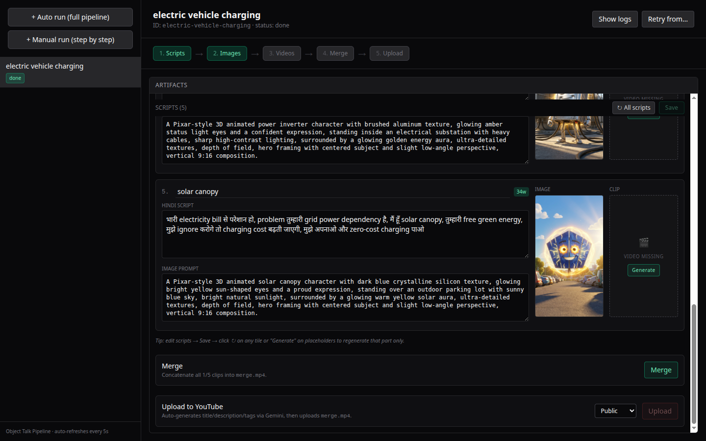
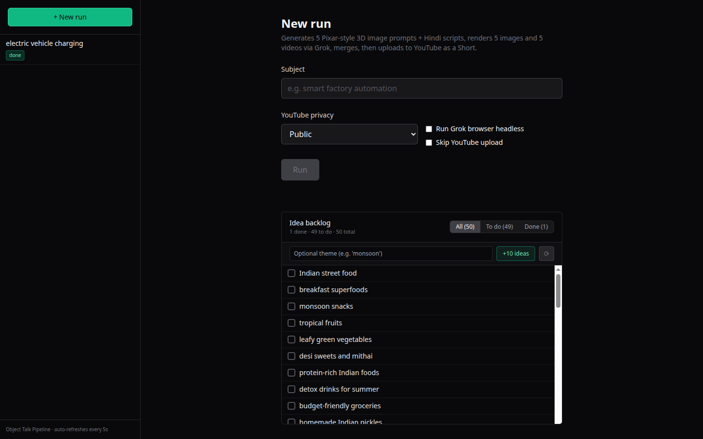
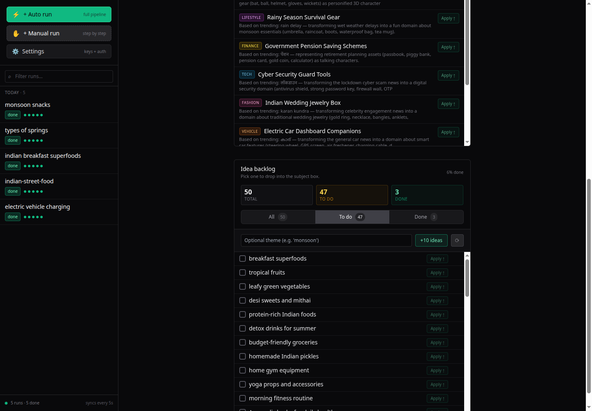
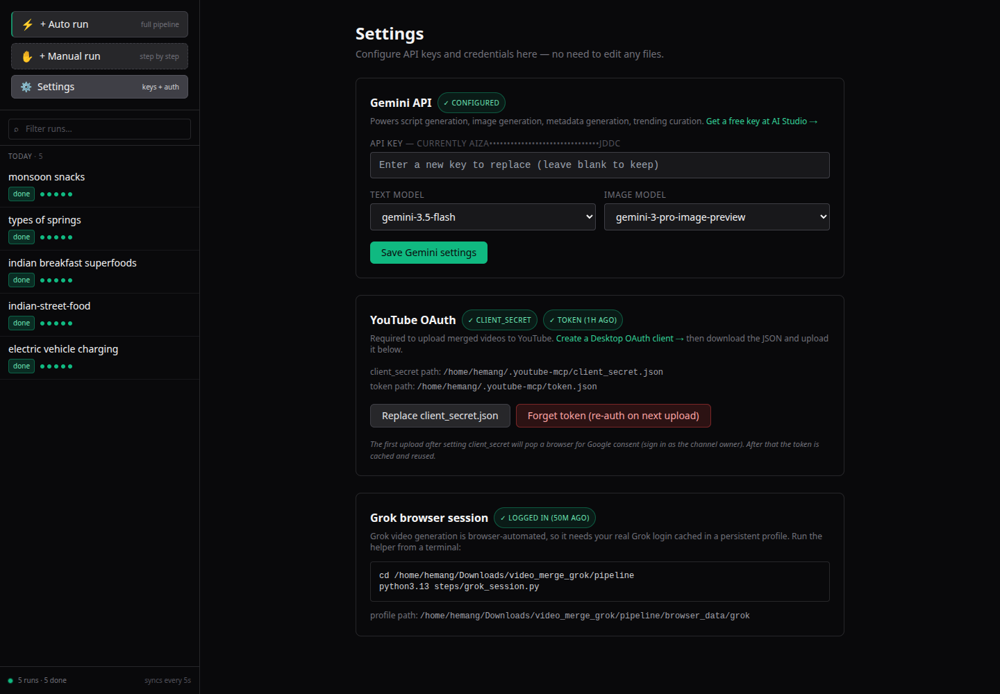

<div align="center">

# Object Talk Pipeline

### Hindi YouTube Shorts in one click — from a single subject to an uploaded Reel, fully hands-off.

<p>
  
  
  
  
  <a href="https://hjlabs.in"></a>
</p>

<p>
  
  
  
  
  
  
  
  
  
  
</p>

<a href="docs/screenshots/01-auto-run.png">
  
</a>

<sub><i>Pick a subject. Get 5 personified Pixar-style 3D characters talking Hindi to camera, merged into a 50-second YouTube Short, auto-uploaded.</i></sub>

</div>

---

<details>
<summary><b>📑 Table of Contents</b></summary>

- [Live examples](#live-examples--shorts-produced-by-this-pipeline)
- [What it does](#what-it-does)
- [Highlights](#highlights)
- [Quickstart](#quickstart)
- [Architecture](#architecture)
- [API surface](#api-surface)
- [Costs](#costs-rough-per-full-pipeline-run)
- [Notable design decisions](#notable-design-decisions)
- [Troubleshooting](#troubleshooting)
- [License](#license)
- [Contact](#contact)

</details>

---

## Live examples — Shorts produced by this pipeline

<table>
<tr>
  <td align="center" width="33%">
    <a href="https://youtube.com/shorts/AbIxt_bP7FQ"></a><br/>
    <a href="https://youtube.com/shorts/AbIxt_bP7FQ"><b>▶ Smart Factory Heroes</b></a>
  </td>
  <td align="center" width="33%">
    <a href="https://youtube.com/shorts/L_ANLwXPGcM"></a><br/>
    <a href="https://youtube.com/shorts/L_ANLwXPGcM"><b>▶ Indian Street Food</b></a>
  </td>
  <td align="center" width="33%">
    <a href="https://youtube.com/shorts/8V-eQM8zLcQ"></a><br/>
    <a href="https://youtube.com/shorts/8V-eQM8zLcQ"><b>▶ Breakfast Superfoods</b></a>
  </td>
</tr>
<tr>
  <td align="center" width="33%">
    <a href="https://youtube.com/shorts/Ns0Y0-VF56c"></a><br/>
    <a href="https://youtube.com/shorts/Ns0Y0-VF56c"><b>▶ EV Charging</b></a>
  </td>
  <td align="center" width="33%">
    <a href="https://youtube.com/shorts/WVTmfwQ8vDE"></a><br/>
    <a href="https://youtube.com/shorts/WVTmfwQ8vDE"><b>▶ Monsoon Snacks</b></a>
  </td>
  <td align="center" width="33%">
    <a href="https://youtube.com/shorts/SS92CmARvn8"></a><br/>
    <a href="https://youtube.com/shorts/SS92CmARvn8"><b>▶ Types of Springs</b></a>
  </td>
</tr>
</table>

<p align="center"><sub>🌐 Built by <a href="https://hjlabs.in">hjLabs.in</a> · Founder <a href="https://www.linkedin.com/in/hemang-joshi-046746aa">Hemang Joshi</a></sub></p>

---

## What it does

Each run produces a 50-second YouTube Short composed of **5 ten-second clips**.
Each clip stars a personified 3D character (e.g. "Robotic Arm", "Mango", "PLC
Controller") confronting the viewer in Hindi about a relatable problem in that
domain.

<table align="center">
<tr>
  <td align="center"><b>1. Scripts</b><br/><sub>Gemini text</sub></td>
  <td align="center">→</td>
  <td align="center"><b>2. Images</b><br/><sub>Gemini image</sub></td>
  <td align="center">→</td>
  <td align="center"><b>3. Videos</b><br/><sub>Grok Imagine</sub></td>
  <td align="center">→</td>
  <td align="center"><b>4. Merge</b><br/><sub>ffmpeg</sub></td>
  <td align="center">→</td>
  <td align="center"><b>5. Upload</b><br/><sub>YouTube API</sub></td>
</tr>
</table>

**Two modes:**

| | |
|---|---|
| **⚡ Auto run** | Full pipeline runs end-to-end (~5–7 min per video). |
| **✋ Manual run** | Only scripts auto-generate; you trigger each image / clip / merge / upload step. |

---

## Highlights

### Auto run page

5-step preview, cost/time badges, advanced options (headless + skip-upload + parallel), Gemini-generated idea backlog + live Google Trends curation below.


### Manual run page

Step-by-step mode with auto vs. click stepper, "when to use" callout, example-subject chips.



### Run detail — script editor with image + clip per row

Each of the 5 scripts gets a row showing its image, video, and editable Hindi
text + image prompt side-by-side. Word-count meter enforces the 10s
speakable budget. ↻ regenerate any individual image or clip.




### Merge + Upload

Final actions card with progress indicators, ETA, privacy toggle, copy-URL
button, and post-upload success state with YouTube link.



### Idea backlog + Live Google Trends

50 seed subjects + Gemini-generated additions, with done/todo filtering. Plus
a Trending panel that pulls **live Google Trends RSS** and uses Gemini to
convert raw news/celebrity trends into Object-Talk-suitable domains. Category
filter (food / tech / health / lifestyle / etc.) is strict.




### Settings — configure everything in-app

No file editing needed. The settings page handles Gemini API key + model
selection, YouTube OAuth client secret upload, and Grok session status.



---

## Quickstart

### Requirements

- **Python 3.13** (this project uses system pip, not a per-project venv)
- **Node.js 20+** (for the Vite frontend)
- **ffmpeg** on PATH
- **System Chromium build** (auto-downloaded by CloakBrowser on first run)
- A **Gemini API key** ([free at Google AI Studio](https://aistudio.google.com/app/apikey))
- A Google Cloud project with **YouTube Data API v3** enabled and an OAuth
  Desktop client (for uploads — optional)
- A **Grok / X account** with Imagine access (for video generation)

### Install

```bash
git clone https://github.com/hemangjoshi37a/object-talk-pipeline.git
cd object-talk-pipeline/pipeline

# Python deps
pip3.13 install requests playwright google-auth google-auth-oauthlib \
                google-api-python-client cloakbrowser fastapi 'uvicorn[standard]'

# Frontend deps
cd web && npm install && cd ..

# Stealth Chromium (first run auto-downloads ~200MB)
python3.13 -c "import cloakbrowser; cloakbrowser.ensure_binary()"
```

### Run

```bash
./run.sh          # starts both backend (:8765) and frontend (:5180), Ctrl+C stops both
```

Open **http://localhost:5180/** and click **Settings** to configure your keys.

`run.sh` subcommands: `up` (default), `stop`, `status`, `restart`.

### Configure keys in the UI

1. Open the app → **Settings** (sidebar)
2. Paste your **Gemini API key**, pick text/image models
3. Upload your **YouTube OAuth client_secret.json** (if you want to upload to YouTube)
4. From a terminal, run `python3.13 steps/grok_session.py` once to log into Grok
5. Done — go to **Auto run** or **Manual run** and pick a subject

---

## Architecture

```
pipeline/
├── webapp.py                 # FastAPI backend
├── run.sh                    # start/stop both servers
├── pipeline.py               # CLI orchestrator (auto run = subprocess of this)
├── config.py                 # loads .env, exposes paths + model IDs
├── prompts/
│   └── object_talk_system.md # the Pixar-3D + 5-beat Hindi system prompt
├── steps/
│   ├── generate_scripts.py   # Gemini text → 5 scripts JSON
│   ├── generate_images.py    # Gemini image → 5 PNG/JPGs at 9:16
│   ├── generate_videos.py    # CloakBrowser+Playwright → 5 MP4s via Grok
│   ├── merge_videos.py       # ffmpeg concat
│   ├── upload_video.py       # YouTube Data API v3 upload
│   ├── grok_session.py       # one-time interactive Grok login helper
│   └── inspect_grok_ui.py    # DOM-inspector for adapting to UI changes
└── web/                      # Vite + React + TS + Tailwind frontend
    └── src/components/
        ├── Sidebar.tsx
        ├── NewRunForm.tsx     ManualRunForm.tsx
        ├── RunView.tsx        StepBar.tsx
        ├── ScriptsEditor.tsx  ArtifactsPanel.tsx
        ├── LogPanel.tsx
        ├── IdeasPanel.tsx     TrendingPanel.tsx
        └── Settings.tsx
```

### Backend event model

One `RunBus` per run-id. Multiple `Job`s (primary pipeline + auxiliary
per-item regens) all publish events into the same bus. SSE subscribers see
interleaved logs from every concurrent subprocess.

### API surface

| Method | Path | Purpose |
|---|---|---|
| GET | `/api/runs` | List runs (filesystem + active) |
| GET | `/api/runs/{id}` | Run state + log tail |
| POST | `/api/runs` | Start auto run |
| POST | `/api/runs/manual` | Start manual (scripts only) |
| POST | `/api/runs/{id}/cancel` | Kill subprocess |
| POST | `/api/runs/{id}/retry` | Retry from a step |
| DELETE | `/api/runs/{id}` | Delete run + files |
| GET | `/api/runs/{id}/events` | **SSE event stream** |
| GET | `/files/{id}/{name}` | Serve generated artifacts |
| GET/PUT | `/api/runs/{id}/scripts` | Read/edit scripts.json |
| POST | `/api/runs/{id}/regen/scripts` | Regenerate scripts |
| POST | `/api/runs/{id}/regen/image/{idx}` | Regenerate single image (concurrent allowed) |
| POST | `/api/runs/{id}/regen/video/{idx}` | Regenerate single clip |
| POST | `/api/runs/{id}/merge` | Manual merge |
| POST | `/api/runs/{id}/upload` | Manual YouTube upload |
| GET/PUT | `/api/settings/...` | In-app settings |
| POST | `/api/trending` | Live Google Trends → curated subjects |
| POST | `/api/ideas/generate` | Gemini-generated subject ideas |

---

## Costs (rough, per full pipeline run)

| Item | Cost |
|---|---|
| Gemini text (scripts + metadata + trending) | ~$0.01 |
| Gemini image (5× 9:16) | ~$0.20 |
| Grok video gen | covered by your Premium subscription |
| YouTube quota | 1,600 / 10,000 daily units per upload (~6 uploads/day) |

---

## Notable design decisions

- **No per-project venv** — uses system `python3.13` + `pip3.13`. Keeps the
  setup portable; no activation step.
- **No official Google Trends API exists** — we pull the
  semi-official RSS at `https://trends.google.com/trending/rss?geo=<CC>` and
  pipe it through Gemini to convert celebrity/news trends into Object-Talk
  *domain* subjects.
- **CloakBrowser, not vanilla Playwright Chromium** — Grok has Cloudflare /
  bot detection. CloakBrowser ships a stealth-patched Chromium that passes
  the usual detection tests. We also use humanized typing (variable delays,
  occasional pauses) and pre-click mouse jitter.
- **File-based lock on the Grok profile** — only one Chrome instance can use
  a user_data_dir at a time. We acquire `pipeline/browser_data/grok.lock`
  with `fcntl.flock` before launching, so concurrent runs queue politely
  instead of crashing with `ProcessSingleton`.
- **Auxiliary jobs for concurrent image regen** — image generations bypass
  the per-run primary-job lock and stream logs into the same RunBus, so 5
  parallel image regens interleave their output in one log panel.

---

## Troubleshooting

- **Gemini script generation fails after retries** — the 40-word Hindi cap is
  strict. Edit `MAX_WORDS` in `steps/generate_scripts.py` (currently 45) or
  loosen the system prompt at `prompts/object_talk_system.md`.
- **Grok video gen times out / Cloudflare challenge** — open
  `http://localhost:5180/`, watch the headed browser (don't tick "headless"),
  solve any challenge once, future runs will reuse the session.
- **YouTube `403 access_denied`** — your OAuth consent screen is in
  Production without verification. Switch back to **Testing** mode in Google
  Cloud Console and add yourself as a Test user.
- **YouTube `Temporary failure in name resolution`** — local DNS / network
  hiccup; not a code bug. Retry when connectivity recovers.
- **Backend can't pick up new .env values** — `setdefault` semantics meant
  the running process kept the old key. Since the in-app Settings page now
  directly writes `os.environ` *and* spawns new subprocesses with the
  current env, this is resolved. For deep changes, restart with `./run.sh restart`.

---

## License

MIT — see [LICENSE](LICENSE).

## Acknowledgements

- The **Object Talk 2.0 (Hindi)** content format inspiration
- **Grok Imagine** for image-to-video generation
- **Google Gemini** for text + image generation
- **CloakBrowser** for stealth Chromium
- **xAI / Google Trends RSS** for live trending data

---

## Contact

**Hemang Joshi** -- Founder, [hjLabs.in](https://hjlabs.in)

[](mailto:hemangjoshi37a@gmail.com)
[](https://www.linkedin.com/in/hemang-joshi-046746aa)
[](https://www.youtube.com/@HemangJoshi)
[](https://wa.me/917016525813)
[](https://t.me/hjlabs)

**hjLabs.in** -- Industrial Automation | AI/ML | IoT | SEO Tools

Serving **15+ countries** with a **4.9 Google rating**

[](https://hjlabs.in)

---
